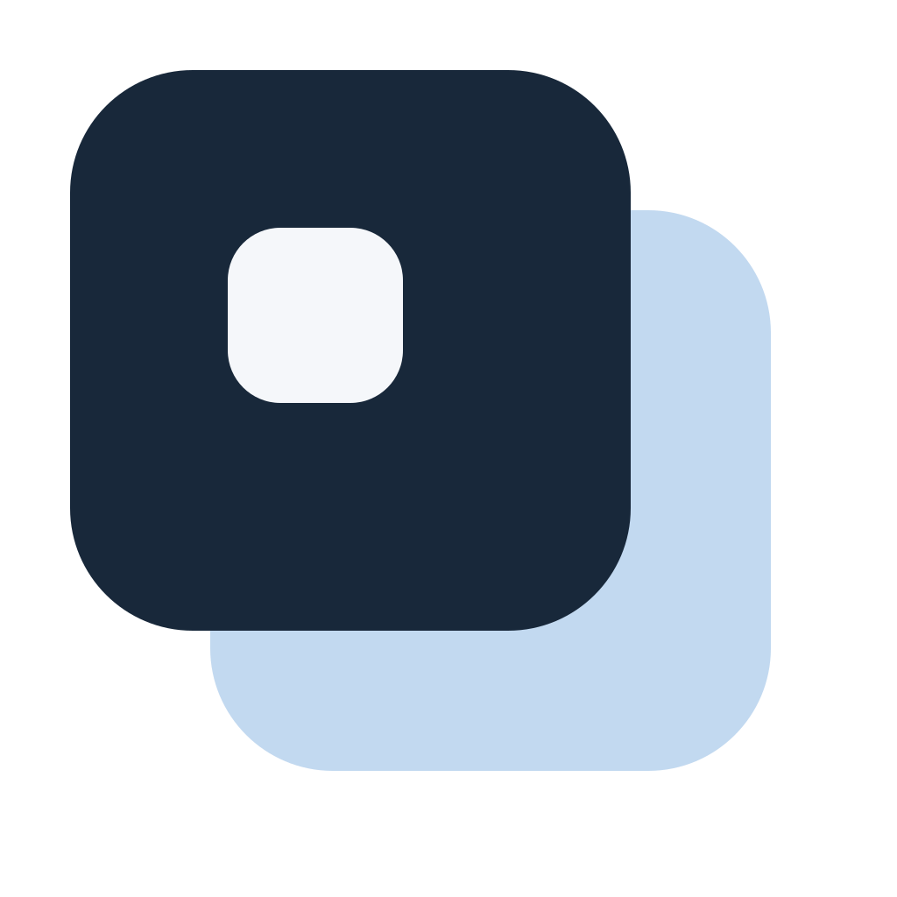
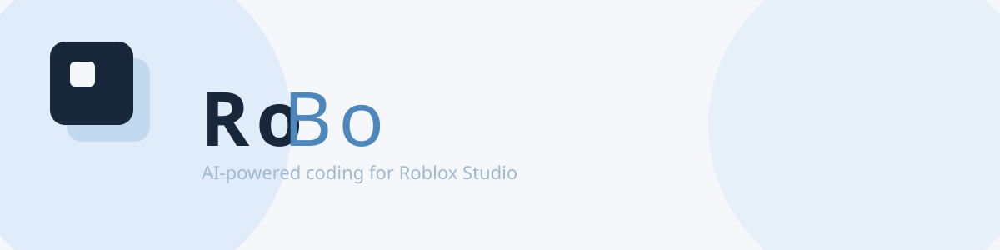

<p align="center">
  
</p>

<p align="center">
  <a href="https://github.com/amagibrilliantpark/RoBo/releases">
    
  </a>
  <a href="LICENSE">
    
  </a>
</p>



# RoBo

A desktop app that brings AI-powered agentic coding assistance to Roblox Studio. It connects an AI agent to your project through SyncRo, so the AI can read and write code that syncs directly into Studio.

## What it does

You type what you want in a chat interface. The AI writes Luau code, creates files, and SyncRo pushes those files into Roblox Studio in real time. No copy-pasting, no manual file management.

## How it works

RoBo runs three things behind the scenes:

- **Electron app** — the UI you interact with
- **OpenCode server** — handles the AI conversations
- **SyncRo** — syncs files between your computer and Roblox Studio

When you send a message, it goes to OpenCode. The AI reads your project files, writes code, and SyncRo picks up the changes and sends them to Studio.

## Requirements

- **Roblox Studio** — RoBo automatically installs the SyncRo plugin into Roblox Studio's Plugins folder on first launch, and the plugin connects to RoBo automatically when you open Studio. No manual install or connection is needed; just have Roblox Studio installed.

### Using OpenCode

You have two options for the AI backend:

1. **Free models** — OpenCode offers free models out of the box. Just start RoBo and start using it, no API key needed.
2. **Your own API key** — If you have any API key, you can connect it directly from RoBo: click **Add** in the model selector, pick a provider (or add a custom one), and enter your API key or complete the OAuth flow. No terminal needed.

OpenCode (bundled as opencode.exe) and SyncRo are included in the installer — you don't need to install them separately.

## Usage

1. Open Roblox Studio and load your project
2. Start RoBo
3. **SyncRo connects automatically** — The SyncRo plugin connects to the server automatically when you open Studio
4. Type what you want in the chat — the AI writes code and SyncRo syncs it to Studio

> **Important:** The SyncRo plugin connects automatically when you open Roblox Studio. No manual connection or port entry is needed.

## Project structure

```
RoBo/
├── .sessions/                   # Session file snapshots
├── AGENTS.md                    # AI behavior instructions
├── SyncRo.rbxmx                 # SyncRo plugin
├── assets/                      # Assets (logo, banner)
├── default.project.json         # SyncRo project config
├── desktop-app/                 # Electron desktop application
├── logs/                        # Logs
├── opencode.exe                 # OpenCode binary (bundled)
├── opencode.json                # OpenCode config
├── plugin/                      # Plugin files
├── src/                         # Roblox game source
├── syncro.exe                   # SyncRo binary
└── tests/                       # Tests
```

## Session isolation

Each AI chat session has its own snapshot of the `src/` directory and config files (`default.project.json`, `opencode.json`, `AGENTS.md`), stored in `.sessions/`. When you switch sessions, the current files are saved and the target session's files are restored. This keeps file changes isolated per session without touching SyncRo or using junctions.

## Platform support

Windows only.

---

## Development

### From source

```bash
cd desktop-app
npm install
npm start
```

### Build

```bash
cd desktop-app
npm run build:win
```

Build output goes to `desktop-app/dist/`.
